# AscendFT-GEMM
AscendFT-GEMM is a high-performance fault-tolerant GEMM design for Ascend NPUs

AscendFT-GEMM are coding based on the CATLASS, a leading open-source operator template library for Ascend NPUs. We completely implement the non-fault-tolerant GEMM and AscendFT-GEMM by ourselves but leveraging the template to standardize the code style. 

The core of our code to realize baseline GEMM and fault-tolerant GEMM can be found at the path: example/cube_op_self/gemm 

(The core block level code for baseline GEMM: examples/cube_op_self/gemm/block/block_mmad_pingpong_preload.hpp; Thre core kernel level code for baselien GEMM: examples/cube_op_self/gemm/kernel/matmul_epilogue_preload.hpp)

(The core block level code for fault-tolerant AscendFT-GEMM: examples/cube_op_self/gemm/block/block_mmad_pingpong_fault_abe_spec_no_splitk_robust.hpp; The core kernel level code for AscendFT-GEMM: examples/cube_op_self/gemm/kernel/matmul_epilogue_asvar_thre_abft_no_splitk_aic_aiv_pipe_mixed_spec_robust.hpp)

## Running examples of Ascend-GEMM

### 0. Install CANN Environment
#### 0.1) prepare the hardware
Currently, our work supports the Ascend 910B/910C NPU devices on the Atlas A2/A3 Servers. Please run our code on these servers which have installed the npu-driver and npu-firmware environments.
#### 0.2) install the software environment
##### 0.2.1) Download the packages
Our work is recommended running at the CANN 8.2.1 environments. Please download the source at [Ascend resouce download center](https://www.hiascend.com/developer/download/community/result?module=cann&cann=8.2.RC1.alpha003), and find the toolkit and kernel package as follows:

  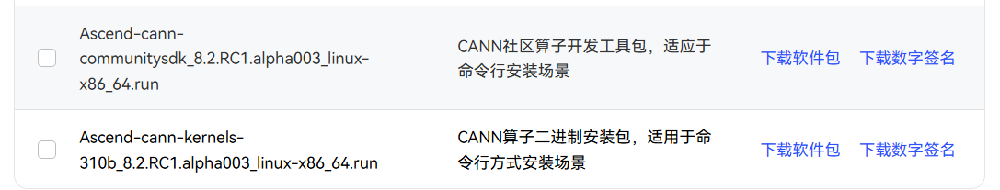
   
  <em>Figure 1: Required Package In the List</em>

After that, please upload the packages to the specific path of the server (e.g., ${HOME})

##### 0.2.2) Increase the execution permissions for the software package

chmod +x Ascend-cann-toolkit_8.3.RC1.alpha003_linux-aarch64.run

chmod a+x Ascend-cann-kernels-910b_8.2.RC1.alpha003_linux-aarch64.run

##### 0.2.3) Install the packages:

./Ascend-cann-toolkit_8.3.RC1.alpha003_linux-aarch64.run --install

./Ascend-cann-kernels-910b_8.2.RC1.alpha003_linux-aarch64.run --install

##### 0.2.4) Add the configuration to the PATH:
The configuration script for environment variables is named "set_env.sh". The current installation path is exemplified as ${HOME}/Ascend:

###### a) Add the configuration to the ${HOME}/.bashrc:

export ASCEND_HOME_PATH=${HOME}/Ascend/ascend-toolkit/latest

export ASCEND_CANN_PACKAGE_PATH=${HOME}/Ascend/latest

export ASCEND_INSTALL_PATH=${HOME}/Ascend/ascend-toolkit/latest

export ASCEND_HOME_DIR=${HOME}/Ascend/ascend-toolkit/latest

source ${HOME}/Ascend/ascend-toolkit/set_env.sh

###### b) Make the configuration take effect:

source .bashrc (or just: source ${HOME}/Ascend/ascend-toolkit/set_env.sh)

### 1. Run the code:

#### 1.1 Compiling Code

After clone the code to the server, e.g., ${HOME} in this example:

a) enter the path: ${HOME}/AscendFT-GEMM/

b) Build the executable file:

bash scripts/build.sh 03_matmul_add_self_preload_fp32 (for FP32 precision)

bash scripts/build.sh 03_matmul_add_self_preload_bf16 (for BF16 precision)

#### 1.2 Run Code

##### 1.2.1 Params:
The abstracted command-line parameter instructions can be expressed as follows:
./03_matmul_add m n k [device_id,make_golden]"

| Item | Discription | Rquired/Optional|
|------|------------|------------|
| m | outer row dimension size|Rquired|
| n | outer column dimension size|Required|
| k | reduction dimension size |Rquired|
| device_id | ID of NPU card,0~7 |Optional|
| make_golden | 1: completely validate the correctness of each element; 0: validate the correctness of row checksum |Optional|

##### 1.2.2 FP32 Precision:

a) Run the examples (Row-checksum validation):

cd output/bin/

./03_matmul_add_self_preload_fp32 4096 4096 4096 1 0

Results:

  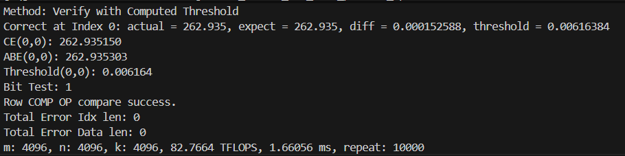
   
  <em>Figure 2: Ascend-GEMM results (FP32) validated by row checksum</em>

b) Run the examples (Element-wise validation):

cd output/bin/

./03_matmul_add_self_preload_fp32 1024 1024 1024 1 1

Results:

  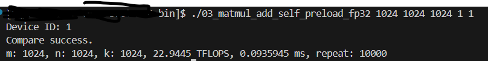
   
  <em>Figure 3: Ascend-GEMM results (FP32) validated by element-wise compare</em>

##### 1.2.3 BF16 Precision:

a) Run the examples (Row-checksum validation):
cd output/bin/

./03_matmul_add_self_preload_bf16 4096 4096 4096 1 0

Results:

  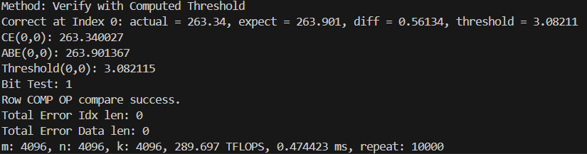
   
  <em>Figure 4: Ascend-GEMM results (BF16) validated by row checksum</em>

b) Run the examples (Element-wise validation):
cd output/bin/

./03_matmul_add_self_preload_bf16 1024 1024 1024 1 1

Results:

  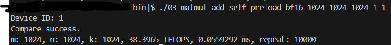
   
  <em>Figure 5: Ascend-GEMM results (BF16) validated by element-wise compare</em>

## Running examples of AscendFT-GEMM

To demonstrate the 1) ABFT-based verifaction functionality and 2) the competitive throughput maintained by AscendFT-GEMM, we present the experiment scripts under BF16 and FP32 precisions. In these examples, we provide specific scripts for each precision under different range of problem sizes respectively. Since we do not inject errors in these examples, the expected results are to report no-error without false alarm, i.e., the verification-bit ouput for each row in each block is 1 (output 0 at $i$-th row of block $j$, namely (i,j) means an detected error at the corresponding row in the specific block)

### 1. Run the code:

#### 1.1 Compiling Code

After clone the code to the server, e.g., ${HOME} in this example:

##### a) enter the path: 

${HOME}/AscendFT-GEMM/

##### b) Build the executable file:

b.1) for small matrices ($M\times N \times K < 2048^{3}$)

bash scripts/build.sh 18_matmul_ft_abe_aic_thre_no_splitk_asvar_ft_spec_fp32_small_robust_inited (for FP32 precision)

bash scripts/build.sh 18_matmul_ft_abe_aic_thre_no_splitk_asvar_ft_spec_bf16_small_robust_inited (for BF16 precision)

b.2) for medium matrices ($2048^{3} \leq M\times N \times K \leq 4096^{3}$)

bash scripts/build.sh 18_matmul_ft_abe_aic_thre_no_splitk_asvar_ft_spec_fp32_medium_robust_inited (for FP32 precision)

bash scripts/build.sh 18_matmul_ft_abe_aic_thre_no_splitk_asvar_ft_spec_bf16_medium_robust_inited (for BF16 precision)

b.3) for large matrices ($M\times N \times K > 4096^{3}$)

bash scripts/build.sh 18_matmul_ft_abe_aic_thre_no_splitk_asvar_ft_spec_fp32_large_robust_inited (for FP32 precision)

bash scripts/build.sh 18_matmul_ft_abe_aic_thre_no_splitk_asvar_ft_spec_bf16_large_robust_inited (for BF16 precision)

#### 1.2 Run Code

##### 1.2.1 Params:

The abstracted command-line parameter instructions can be expressed as follows:
18_matmul_ft m n k rt beta thre_type e_max red_cores split_ks [device_id]"

| Item | Discription | Rquired/Optional|
|------|------------|------------|
| m | outer row dimension size|Rquired|
| n | outer column dimension size|Required|
| k | reduction dimension size |Rquired|
| rt| The exponential coefficient in A-ABFT, 8 by default|Required|
|beta|The base coefficient in A-ABFT, 0 by default| Required|
|thre_type| The threshold type in A-ABFT, 0 by default|Required|
|e_max|The constant coefficient in the V-ABFT formula, BF16: 0.001; FP32: 0.0000022|Required|
|red_cores| The number of AI cores used when computing the local aggregation results for each block tile of matrix B,  it is recommended to be set as 8|Required|
| split_ks |For blocks in Phase II, we now support to apply the Split-K mechanism only on these blocks for further speedup when m and n is kindly small or medium(e.g.,m,n<4096), when adopting local split-K scheme, it is recommended to be set as 2; Otherwise, please set it as 1|Required|
| device_id | ID of NPU card,0~7 |Optional|

##### 1.2.2 FP32 Precision:

a) Run the examples ($M\times N \times K = 4096^{3}$):

cd output/bin/

./18_matmul_ft_abe_aic_thre_no_splitk_asvar_ft_spec_fp32_medium_robust_inited 4096 4096 4096 8 0 0 0.000002 8 1 0

Results:

  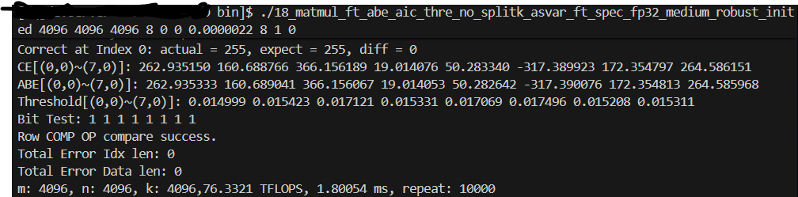
   
  <em>Figure 6: AscendFT-GEMM results (FP32) validated by row-checksum-based ABFT</em>

##### 1.2.3 BF16 Precision:

a) Run the examples  ($M\times N \times K = 4096^{3}$):
cd output/bin/

./18_matmul_ft_abe_aic_thre_no_splitk_asvar_ft_spec_bf16_medium_robust_inited 4096 4096 4096 8 0 0 0.001 8 1 0

Results:

  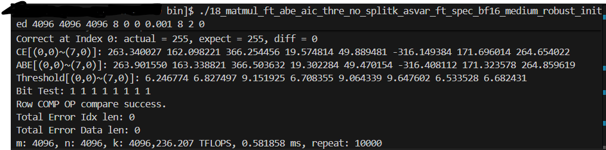
   
  <em>Figure 7: AscendFT-GEMM results (BF16) validated by row-checksum-based ABFT</em>

## Running examples of AscendFT-GEMM with Fault Injection

To demonstrate the row-wise SDC detection functionality maintained by AscendFT-GEMM, we present the experiment scripts which artificially inject SDC errors by executing bit-flips in on-chip buffers. In these examples, we provide specific scripts which detect SDC errors for GEMM issues where input matrices $A$ and $B$ following uniform distributions. The expected results are to report row indices of the injected errors in each block, i.e., the verification-bit ouput for non-error rows in each block is 1, which output 0 at $i$-th row of block $j$, namely (i,j) means an detected error at the corresponding row in the specific block, and the detected error coordinates are reported as well.

Each time the script is executed, the kernel runs 10,000 times. In each run of the kernel, We randomly select error-injection locations. Moreover, we regenerate the input matrices $A$ and $B$ at regular kernel-run intervals determined by the block size. Upon completion of execution, we record the number of injected errors, the number of correctly detected errors, the error detection rate, and the false positive rate, and etc.

### 1. Run the code:

#### 1.1 Compiling Code

After clone the code to the server, e.g., ${HOME} in this example:

##### a) enter the path: 

${HOME}/AscendFT-GEMM/

##### b) Build the executable file:

bash scripts/build.sh 24_FI_test_fp32 (for FP32 precision)
bash scripts/build.sh 24_FI_test_bf16 (for BF16 precision)

#### 1.2 Run Code

##### 1.2.1 Params:

The abstracted command-line parameter instructions can be expressed as follows:
18_matmul_ft m n k rt beta thre_type e_max red_cores split_ks [device_id]"

| Item | Discription | Rquired/Optional|
|------|------------|------------|
| m | outer row dimension size|Rquired|
| n | outer column dimension size|Required|
| k | reduction dimension size |Rquired|
| rt| The exponential coefficient in A-ABFT, 8 by default|Required|
|beta|The base coefficient in A-ABFT, 0 by default| Required|
|thre_type| The threshold type in A-ABFT, 0 by default|Required|
|e_max|The constant coefficient in the V-ABFT formula, BF16: 0.001; FP32: 0.0000022|Required|
|red_cores| The number of AI cores used when computing the local aggregation results for each block tile of matrix B,  it is recommended to be set as 8|Required|
| split_ks |For blocks in Phase II, we now support to apply the Split-K mechanism only on these blocks for further speedup when m and n is kindly small or medium(e.g.,m,n<4096), when adopting local split-K scheme, it is recommended to be set as 2; Otherwise, please set it as 1|Required|
|inject_row_seed| The random seed used for generating the row indices of injected bit-flip errors in each block|Required|
|inject_col_seed| The random seed used for generating the row indices of injected bit-flip errors in each block|Required|
|inject_bit| The bit-position of bit-flip execution (FP32: 31 means sign bit, and 30-23 indicate exponent bits from high to low; BF16: 15 means sign bit, and 14-7 indicate exponent bits from high to low)
|inject_k_unit| Within each block, at most one error is injected into the L0 buffers after local results have been accumulated along the reduction dimension for each K-unit (e.g., 1024). | Required |
|inject_num_blk_limit| The upper limit of the number of the injected errors in each block.| Required |
| device_id | ID of NPU card, 0-7. |Optional|

##### 1.2.2 FP32 Precision:

a) Run the examples ($Bit position: 30 (highest exponent bit)$):

cd output/bin/

./24_FI_test_fp32 4096 4096 4096 8 0 0 0.0000022 8 2 16 16 30 1024 16 0

Results on sampling run iteration:

  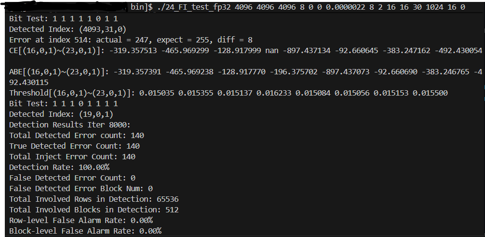
   
  <em>Figure 8: Detection results of AscendFT-GEMM with fault-injection in a sampling run iteration (bit 30, FP32) </em>

Global results:

  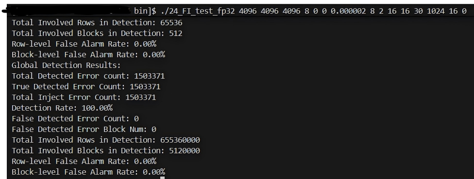
   
  <em>Figure 9: Overview of Global Detection results of AscendFT-GEMM with fault-injection (bit 30, FP32)</em>

b) Run the examples (Bit position: 23 (lowest exponent bit)):

cd output/bin/

./24_FI_test_fp32 4096 4096 4096 8 0 0 0.0000022 8 2 16 16 23 1024 16 0

Results on sampling run iteration:

  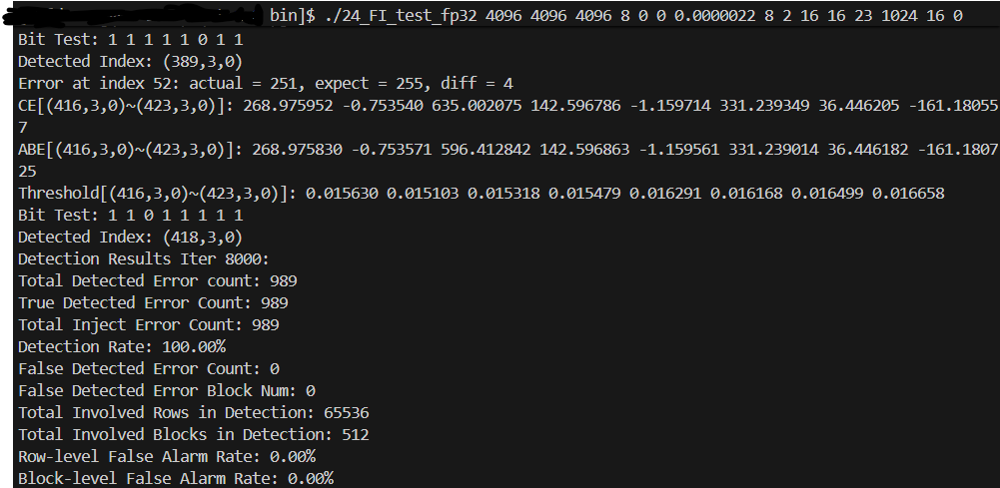
   
  <em>Figure 10: Detection results of AscendFT-GEMM with fault-injection in a sampling run iteration (bit 23, FP32) </em>

Global results:

  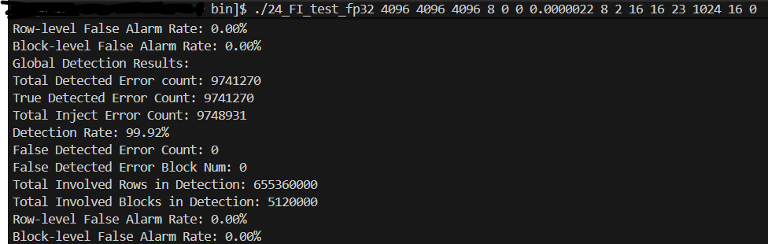
   
  <em>Figure 11: Overview of Global Detection results of AscendFT-GEMM with fault-injection (bit 23, FP32)</em>

##### 1.2.3 BF16 Precision:

a) Run the examples (Bit position: 14 (highest exponent bit)):

cd output/bin/

./24_FI_test_bf16 4096 4096 4096 8 0 0 0.001 8 2 16 16 14 1024 16 0

Results on sampling run iteration:

  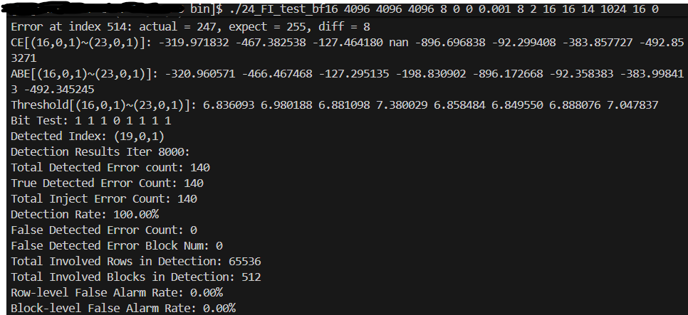
   
  <em>Figure 12: Detection results of AscendFT-GEMM with fault-injection in a sampling run iteration (bit 14, BF16) </em>

Global results:

  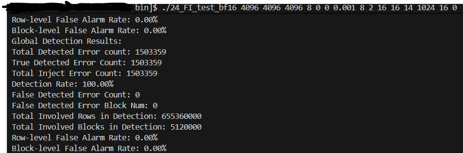
   
  <em>Figure 13: Overview of Global Detection results of AscendFT-GEMM with fault-injection (bit 14, BF16)</em>

b) Run the examples (Bit position: 10 (the fifth highest exponent bit, the lowest high-5-bit position)):

cd output/bin/

./24_FI_test_bf16 4096 4096 4096 8 0 0 0.001 8 2 16 16 10 1024 16 0

Results on sampling run iteration:

  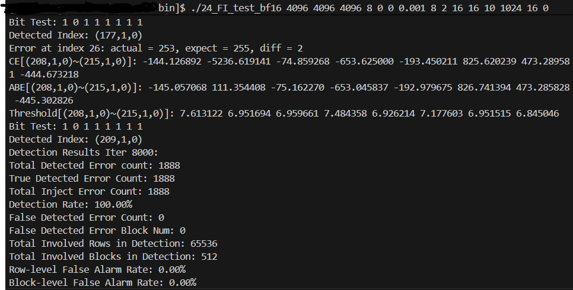
   
  <em>Figure 14: Detection results of AscendFT-GEMM with fault-injection in a sampling run iteration (bit 10, BF16) </em>

Global results:

  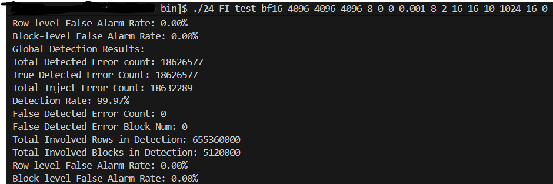
   
  <em>Figure 15: Overview of Global Detection results of AscendFT-GEMM with fault-injection (bit 10, BF16)</em>

